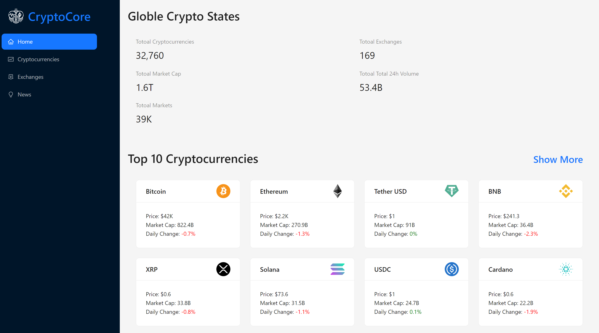

# Crypto-Core - Comprehensive Crypto Application

Crypto-Core is an all-in-one crypto application that provides in-depth data on cryptocurrencies, detailed exchange information, and the latest crypto news. Explore the world of cryptocurrencies with Crypto-Core, your go-to platform for comprehensive crypto insights. This README provides step-by-step instructions for setting up and running the Crypto-Core project.

## Installation

1. **Clone the repository:**

    ```bash
    git clone https://github.com/PrashantAmbaliya/cryptocore.git
    ```

    This command clones the CodeFusion repository to your local machine.

2. **Navigate to the project directory:**

    ```bash
    cd cryptocore
    ```

    This command changes your current working directory to the Crypto-Core project folder.

3. **Install project dependencies:**

    ```bash
    npm install
    ```

    This command installs the required dependencies for the CodeFusion project.

4. **Subscribe to Rapid API:**

    - Go to [Rapid API](https://rapidapi.com/).
    - Create an account or log in if you already have one.
    - Subscribe to the following APIs:
        - Coinbase API
        - Real-Time News Data API

## Configuration for API Access

1. **Configure Coinbase API:**

    - After subscribing to Coinbase API on Rapid API, obtain your API key.
    - Replace the placeholder in `services/cryptoApi.js` with your Coinbase API key:

    ```javascript
    // services/cryptoApi.js
    const headers = {
        'X-RapidAPI-Key': 'YOUR_RAPID_API_KEY',  // Replace with your Rapid API key
        'X-RapidAPI-Host': 'coinranking1.p.rapidapi.com',
        // Add any additional headers required
    };
    ```

2. **Configure Real-Time News Data API:**

    - After subscribing to Real-Time News Data API on Rapid API, obtain your API key.
    - Replace the placeholder in `services/newsApi.js` with your Real-Time News Data API key:

    ```javascript
    // services/newsApi.js
    const headers = {
        'X-RapidAPI-Key': 'YOUR_RAPID_API_KEY',  // Replace with your Rapid API key
        'X-RapidAPI-Host': 'real-time-news-api.p.rapidapi.com',
        // Add any additional headers required
    };
    ```

## Running the Application

To start the Crypto-Core application, follow the steps below:

```bash
npm start
```

# Usage

1. **Open your web browser and go to [http://localhost:3000](http://localhost:3000).**
2. **Navigate through the application to explore various crypto features.**
3. **Dive into in-depth cryptocurrency details, exchange information, and the latest crypto news.**

# Features

- Comprehensive cryptocurrency data
- Detailed exchange information
- Latest crypto news updates
- User-friendly interface for a seamless crypto experience

Explore Crypto-Core and stay updated with the dynamic world of cryptocurrencies! 🌐🚀
